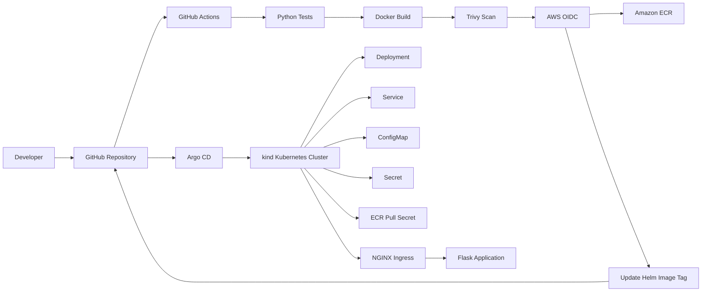

# Cloud Native DevOps Platform

A hands-on cloud-native DevOps project demonstrating automated CI/CD, container security, AWS ECR image publishing, GitOps deployment with Argo CD, and Kubernetes-based application delivery.

## Overview

This project deploys a lightweight Flask application to a Kubernetes cluster running with kind.

The deployment workflow is automated using GitHub Actions and Argo CD:

1. Code is pushed to the `master` branch.
2. GitHub Actions runs Python tests.
3. A Docker image is built.
4. Trivy scans the image for HIGH and CRITICAL vulnerabilities.
5. GitHub Actions authenticates to AWS using OIDC.
6. The image is pushed to Amazon ECR using the Git commit SHA as its tag.
7. The CI pipeline updates the Helm image tag in Git.
8. Argo CD detects the Git change.
9. Argo CD synchronizes the Helm chart to Kubernetes.
10. Kubernetes performs a rolling update.

The application is currently running successfully as version **2.1.0**.

## Architecture



## Technology Stack

| Category | Technology |
|---|---|
| Application | Python 3.13, Flask, Gunicorn |
| Containerization | Docker |
| CI/CD | GitHub Actions |
| Security Scanning | Trivy |
| Container Registry | Amazon ECR |
| AWS Authentication | GitHub OIDC + IAM |
| Kubernetes | kind |
| Package Management | Helm |
| GitOps | Argo CD |
| Ingress | NGINX Ingress Controller |
| Infrastructure Configuration | Kubernetes YAML / Helm |
| Testing | pytest |

## Repository Structure

```text
cloud-native-devops-platform/
├── .github/
│   └── workflows/
│       └── ci.yml
├── app/
│   ├── src/
│   │   ├── __init__.py
│   │   └── app.py
│   ├── tests/
│   │   └── test_app.py
│   ├── Dockerfile
│   ├── requirements.txt
│   └── README.md
├── argocd/
│   └── application.yaml
├── helm/
│   └── cloud-native-app/
│       ├── Chart.yaml
│       ├── values.yaml
│       └── templates/
├── kubernetes/
│   ├── archive/
│   ├── cluster/
│   │   └── kind-config.yaml
│   ├── config/
│   │   ├── app-config.yaml
│   │   └── app-secret.yaml
│   └── namespace/
│       └── app.yaml
├── scripts/
│   └── deploy.sh
├── .gitignore
└── README.md
```

## CI/CD Pipeline

The GitHub Actions workflow is divided into four stages.

### 1. Test

The pipeline:

- Checks out the repository.
- Sets up Python 3.13.
- Uses pip caching.
- Installs application dependencies.
- Runs the pytest test suite.

```bash
pytest app/tests -v
```

### 2. Build, Scan and Push

The Docker image is built using the current Git commit SHA:

```text
cloud-native-app:<commit-sha>
```

Trivy scans the image for HIGH and CRITICAL vulnerabilities.

Only images that pass the security scan continue to the AWS publishing stage.

### 3. AWS Authentication and ECR

GitHub Actions uses GitHub's OIDC identity token to assume an AWS IAM role.

No long-lived AWS access keys are stored in GitHub.

The image is pushed to Amazon ECR in the `eu-central-1` region.

Images are tagged with the immutable Git commit SHA.

### 4. GitOps Update

After the ECR image is verified, the workflow updates:

```text
helm/cloud-native-app/values.yaml
```

with the new image tag.

GitHub Actions commits this change back to the `master` branch using:

```text
[skip ci]
```

This prevents the GitOps update commit from starting another CI pipeline.

## GitOps with Argo CD

Argo CD watches the repository and the Helm chart located at:

```text
helm/cloud-native-app
```

The Argo CD Application is configured to:

- Track the `master` branch.
- Deploy the Helm chart.
- Deploy into the `cloud-native-app` namespace.
- Automatically synchronize changes.
- Prune resources removed from Git.
- Self-heal resources that drift from the desired state.
- Create the destination namespace when required.

The desired state is stored in Git, while Argo CD continuously works to keep Kubernetes synchronized with that state.

## Kubernetes Deployment

The application runs in a kind Kubernetes cluster named:

```text
cloud-native-platform
```

The application namespace is:

```text
cloud-native-app
```

The Helm configuration currently deploys:

- 2 application replicas.
- A ClusterIP Service.
- NGINX Ingress.
- ConfigMap for application configuration.
- Kubernetes Secret for application secrets.
- ECR pull secret for private image authentication.
- CPU and memory requests/limits.
- Liveness and readiness probes.

The application is exposed through:

```text
http://cloud-native.local
```

## Container Registry

The application image is stored in Amazon ECR:

```text
eu-central-1
└── cloud-native-app
```

The image uses the Git commit SHA as an immutable deployment identifier.

Example:

```text
432837989123.dkr.ecr.eu-central-1.amazonaws.com/cloud-native-app:<commit-sha>
```

Kubernetes authenticates to the private ECR registry using:

```text
ecr-registry-secret
```

## Security

### Trivy

Every Docker image is scanned before it can be pushed to ECR.

The CI pipeline fails when HIGH or CRITICAL vulnerabilities are detected.

Previously identified dependency vulnerabilities were remediated by updating affected packages.

### AWS OIDC

GitHub Actions authenticates to AWS through OIDC rather than storing permanent AWS access keys.

The GitHub Actions jobs use:

```yaml
id-token: write
```

and assume the dedicated IAM role:

```text
GitHubActions-CloudNativePlatform-ECR
```

The workflow permissions follow least privilege:

- Test: `contents: read`
- Docker: `contents: read` + OIDC
- ECR verification: `contents: read` + OIDC
- GitOps update: `contents: write`

### Kubernetes Resources

The application uses separate Kubernetes resources for:

- Application configuration.
- Application secrets.
- Private registry authentication.

## Application Endpoints

### Application

```text
GET /
```

Example response:

```json
{
  "application": "Cloud Native DevOps Platform",
  "environment": "kubernetes",
  "hostname": "cloud-native-app-...",
  "status": "Running",
  "version": "2.1.0"
}
```

### Health Check

```text
GET /health
```

Example:

```json
{
  "status": "healthy"
}
```

## Deployment Verification

The deployment can be verified with:

```bash
kubectl get application cloud-native-app -n argocd
```

Expected:

```text
NAME               SYNC STATUS   HEALTH STATUS
cloud-native-app   Synced        Healthy
```

Check the Kubernetes deployment:

```bash
kubectl get deployment cloud-native-app -n cloud-native-app
```

Expected:

```text
NAME               READY   UP-TO-DATE   AVAILABLE
cloud-native-app   2/2     2             2
```

Check the running pods:

```bash
kubectl get pods -n cloud-native-app
```

Check the deployed image:

```bash
kubectl get deployment cloud-native-app \
  -n cloud-native-app \
  -o jsonpath='{.spec.template.spec.containers[0].image}{"\n"}'
```

Test the application:

```bash
curl -s http://cloud-native.local
```

Health check:

```bash
curl -s http://cloud-native.local/health
```

## Troubleshooting Experience

This project included several real deployment and CI/CD issues that were diagnosed and resolved during implementation.

### GitHub Actions OIDC

The initial AWS OIDC configuration required adjustment to correctly restrict the GitHub Actions identity to the repository and branch.

The IAM trust relationship was updated and validated through GitHub Actions.

### ECR IAM Permissions

The CI verification stage initially lacked permission to call:

```text
ecr:DescribeImages
```

The IAM policy was updated so the pipeline could verify the image after pushing it.

### Container Vulnerabilities

Trivy identified vulnerable Python dependencies during the build process.

The affected dependencies were updated and the image was rescanned until the security stage passed.

### Kubernetes ImagePullBackOff

During a GitOps deployment, the new ReplicaSet entered:

```text
ImagePullBackOff
```

The Kubernetes event showed:

```text
403 Forbidden
```

when accessing the private ECR registry.

The deployment was using the correct image pull secret, but the stored ECR authentication token had expired.

Refreshing the ECR pull secret allowed Kubernetes to authenticate and pull the new image.

The rolling update then completed successfully.

## Manual Helm Deployment

A deployment helper is available at:

```text
scripts/deploy.sh
```

It performs:

1. Helm upgrade/install.
2. Deployment rollout verification.
3. Deployment status display.
4. Pod status display.
5. Running image verification.

Example:

```bash
./scripts/deploy.sh
```

Argo CD remains the preferred deployment mechanism for the GitOps workflow.

## Current Deployment Status

The validated environment currently has:

```text
Argo CD:        Synced / Healthy
Replicas:       2
Pods:           2/2 Running
Application:    2.1.0
Health:         healthy
```

## Future Improvements

Possible extensions include:

- Prometheus and Grafana monitoring.
- Centralized logging.
- Kubernetes network policies.
- Automated dependency updates.
- Image signing and verification.
- Terraform-managed AWS resources.
- Deployment to a managed Kubernetes service such as Amazon EKS.
- Progressive delivery with canary or blue/green deployments.
- Automated integration testing.
- Separate development and production environments.

## Project Goals

This project was built to demonstrate practical experience with:

- Containerized application deployment.
- Kubernetes workload management.
- Helm-based application packaging.
- GitHub Actions CI/CD.
- Container vulnerability scanning.
- AWS ECR.
- AWS IAM and GitHub OIDC.
- GitOps principles.
- Argo CD.
- Kubernetes ingress and service networking.
- Troubleshooting failed deployments and container image pulls.
